<!-- README.md is generated from README.Rmd. Edit that file, then re-render
     with devtools::build_readme(). Do not edit README.md by hand. -->

# Applr

A small R package for visualizing linear models. Plots anything from
simple lines to high-dimensional squiggles all with the same functions.

Start by fitting an `lm()`, then hand it to Applr. Explore it with
`autoplot()`, or present it with polish and fine-grained control using
`geom_slice()`. Either way, you can trust the linear model, because you
can see it and control it - something `geom_smooth()` only aspires to.

Also includes label helpers (`geom_slice_subtitle()`,
`geom_slice_text()`), base-R plots (`slice_2d()`), interactive 3-D
surfaces (`scatter_3d()`), LaTeX generator (`lm_latex()`), and a simple
diagnostic helper (`diagnose()`).

Perfect for any **App**lied **l**inear **r**egression.

## Installation

``` r
install.packages("devtools")      # if you don’t have it
devtools::install_github("saundersg/Applr")
library(Applr)
```

## Quick start

``` r
library(Applr)

# One call: scatter + fitted line from any lm()
model <- lm(mpg ~ disp + hp, data = mtcars)
autoplot(model)
#> 
#> Call:
#> lm(formula = mpg ~ disp + hp, data = mtcars)
#> 
#> Residuals:
#>     Min      1Q  Median      3Q     Max 
#> -4.7945 -2.3036 -0.8246  1.8582  6.9363 
#> 
#> Coefficients:
#>              Estimate Std. Error t value Pr(>|t|)    
#> (Intercept) 30.735904   1.331566  23.083  < 2e-16 ***
#> disp        -0.030346   0.007405  -4.098 0.000306 ***
#> hp          -0.024840   0.013385  -1.856 0.073679 .  
#> ---
#> Signif. codes:  0 '***' 0.001 '**' 0.01 '*' 0.05 '.' 0.1 ' ' 1
#> 
#> Residual standard error: 3.127 on 29 degrees of freedom
#> Multiple R-squared:  0.7482, Adjusted R-squared:  0.7309 
#> F-statistic: 43.09 on 2 and 29 DF,  p-value: 2.062e-09

# Or build the plot yourself with a geom_slice() layer
library(ggplot2)
ggplot(mtcars, aes(disp, mpg)) +
  geom_point() +
  geom_slice(model)
```

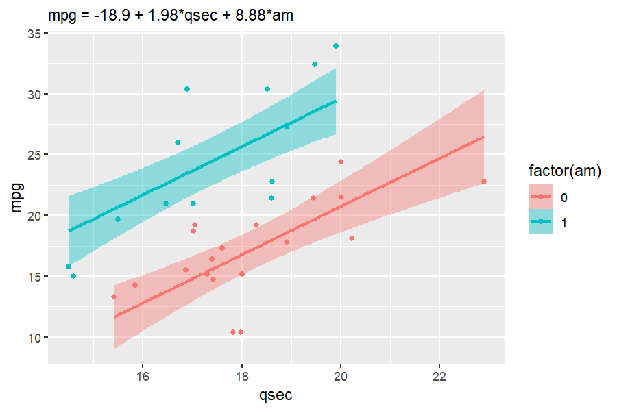

Both report on the console how the predictor you *don’t* see (`hp`) was
handled — it is held at its mean — so it is always clear which slice of
the model you are looking at.

------------------------------------------------------------------------

## `geom_slice()` — your model as a ggplot2 layer

`geom_slice()` draws the prediction line of a fitted `lm()` across your
plot (and its facets). It looks like `geom_smooth()`, but where
`geom_smooth()` fits its own model to the plotted data, `geom_slice()`
draws the model *you* fitted. The predictor on the x-axis varies along
the line; every other predictor is fixed, creating a 2d “slice” of a
high-dimensional model.

- Variables named in `predict_vars` are held at your chosen values.
- Variables mapped to a grouping aesthetic (`aes(color = g)`) are pinned
  to each group’s own value — one line per group.
- Facet variables are pinned to each panel’s value.
- Anything left over is imputed (mean for numeric, most common value for
  factors), with a console message naming the value used.

``` r
library(ggplot2)
model <- lm(mpg ~ disp + hp + cyl, data = mtcars)

ggplot(mtcars, aes(disp, mpg)) +
  geom_point() +
  facet_wrap(~cyl) +
  geom_slice(model, predict_vars = list(hp = 110),
             color = "steelblue", linewidth = 1)
```

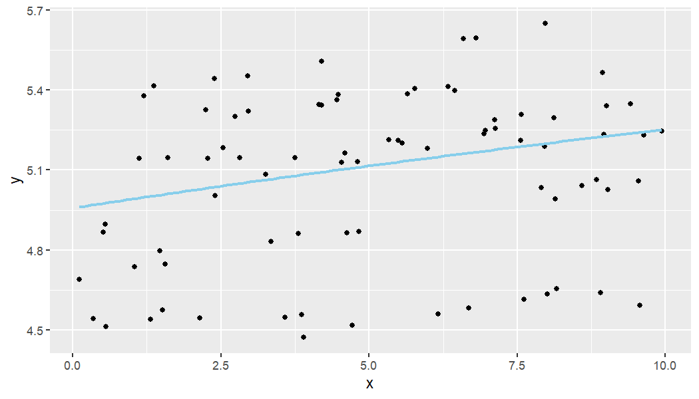

### Choosing slices with `predict_vars`

Give a variable several values to draw one line per value; several
multi-value variables are crossed:

``` r
model <- lm(mpg ~ disp + hp, data = mtcars)

# Three slices of the same model
ggplot(mtcars, aes(disp, mpg)) +
  geom_point() +
  geom_slice(model, predict_vars = list(hp = c(66, 123, 335)))
```

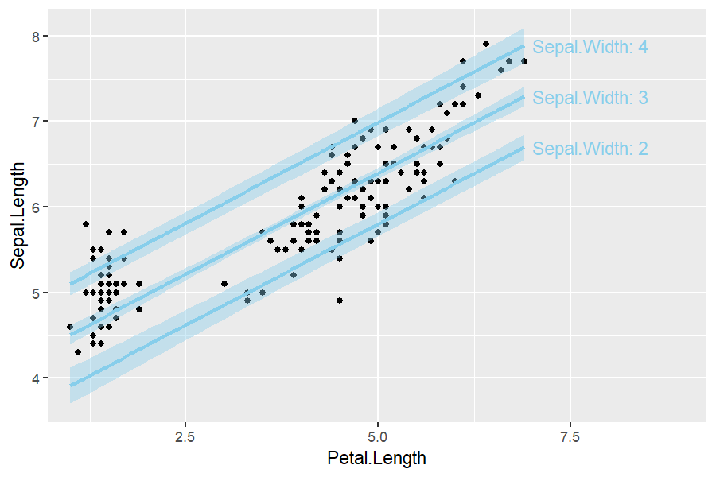

### Confidence and prediction intervals

`interval = "confidence"` or `"prediction"` adds the corresponding
`predict.lm()` ribbon around the line:

``` r
model <- lm(mpg ~ disp + hp, data = mtcars)

ggplot(mtcars, aes(disp, mpg)) +
  geom_point() +
  geom_slice(model, interval = "prediction")
```

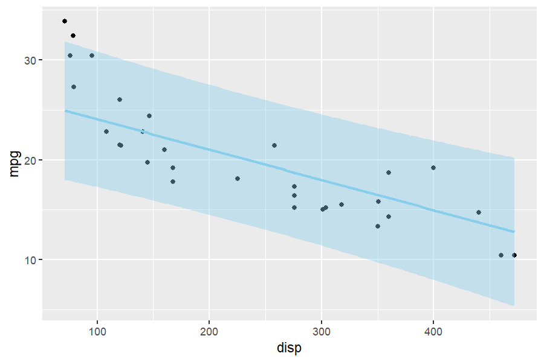

### Projection bands

Where an interval shows uncertainty, `band` shows the *reach of a
predictor*: two edge slices with a translucent ribbon between them.
`band = "variable"` spans that predictor — between the values you gave
in `predict_vars`, or its observed data range when `predict_vars` leaves
it out:

``` r
model <- lm(mpg ~ disp + hp, data = mtcars)

# The band spans hp from 66 to 335
ggplot(mtcars, aes(disp, mpg)) +
  geom_point() +
  geom_slice(model, band = "hp", predict_vars = list(hp = c(66, 335)))
```

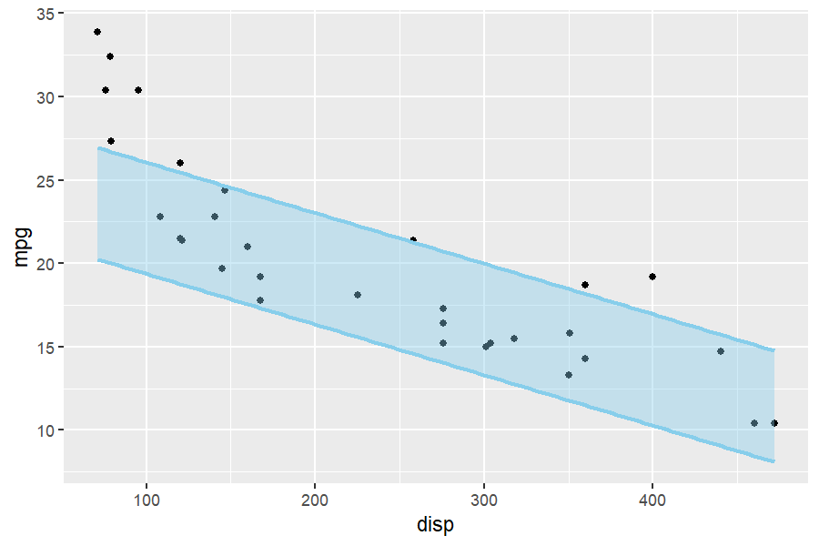

`band = TRUE` infers the variable when there is only one sensible choice
(the one multi-value `predict_vars` entry, or the single predictor the
plot does not otherwise show). `band` cannot be combined with
`interval`.

### Transformed responses

If the model’s response is transformed (e.g. `lm(log(y) ~ x)`) but the
plot shows raw `y`, predictions are back-transformed automatically to
match the y-axis (a message says so). Use `back_transform = FALSE` to
turn this off, or pass a function/name (`exp`, `"log10"`, …) to override
the auto-detection.

``` r
model <- lm(log(mpg) ~ disp + hp, data = mtcars)

ggplot(mtcars, aes(disp, mpg)) +
  geom_point() +
  geom_slice(model)   # back-transformed onto the raw mpg axis
```


### Grouping: one line per group

``` r
model <- lm(mpg ~ disp + factor(cyl), data = mtcars)

ggplot(mtcars, aes(disp, mpg, color = factor(cyl))) +
  geom_point() +
  geom_slice(model)   # cyl pinned per group; the legend labels the lines
```

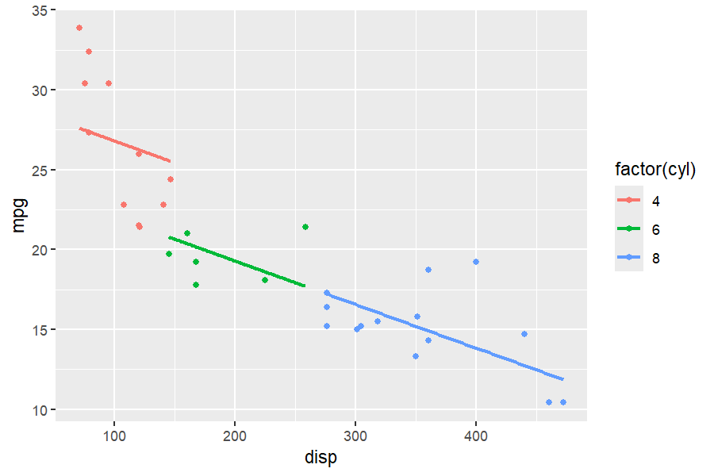

Each group’s line normally stops at its own data range.
`full_range = TRUE` extends every line to the edge of the panel instead
(like `fullrange` in `geom_smooth()`):

``` r
ggplot(mtcars, aes(disp, mpg, color = factor(cyl))) +
  geom_point() +
  geom_slice(model, full_range = TRUE)
```

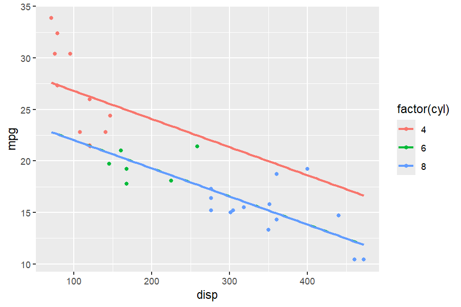

## Labeling the slices

Three companions describe `geom_slice()` lines on the plot itself. They
take no model or `predict_vars` — everything is borrowed from the plot’s
existing `geom_slice()` layers, so add them *after* those layers.

### `geom_slice_text()`

Writes a label at the end of each slice line — multi-value
`predict_vars` draw visually identical lines, and labels tell them apart
(they also work as a legend replacement for grouping aesthetics):

``` r
library(ggplot2)
model <- lm(mpg ~ disp + hp, data = mtcars)

ggplot(mtcars, aes(disp, mpg)) +
  geom_point() +
  geom_slice(model, predict_vars = list(hp = c(66, 123, 335))) +
  geom_slice_text()
```

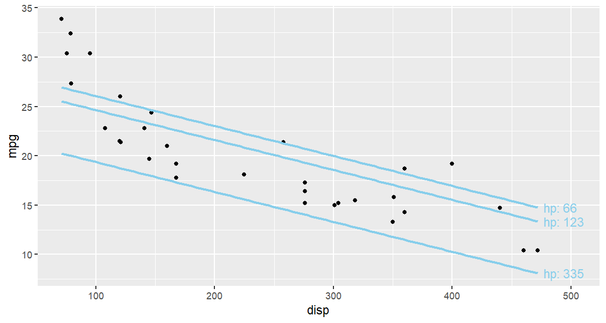

Options: `style` (`"variable"` writes `"hp: 66"`, `"value"` writes bare
values, `"legend"` adds a corner key), `location = "left"`/`"right"`,
`offset`, and `color`.

### `geom_slice_subtitle()` and `geom_slice_caption()`

Fill the plot subtitle (or caption) with the model equation and the held
values the plot does not otherwise show — values already labeled by the
legend, facets, or `geom_slice_text()` are skipped:

``` r
library(ggplot2)
model <- lm(mpg ~ disp + hp, data = mtcars)

ggplot(mtcars, aes(disp, mpg)) +
  geom_point() +
  geom_slice(model, predict_vars = list(hp = 110)) +
  geom_slice_subtitle()   # or geom_slice_caption()
```

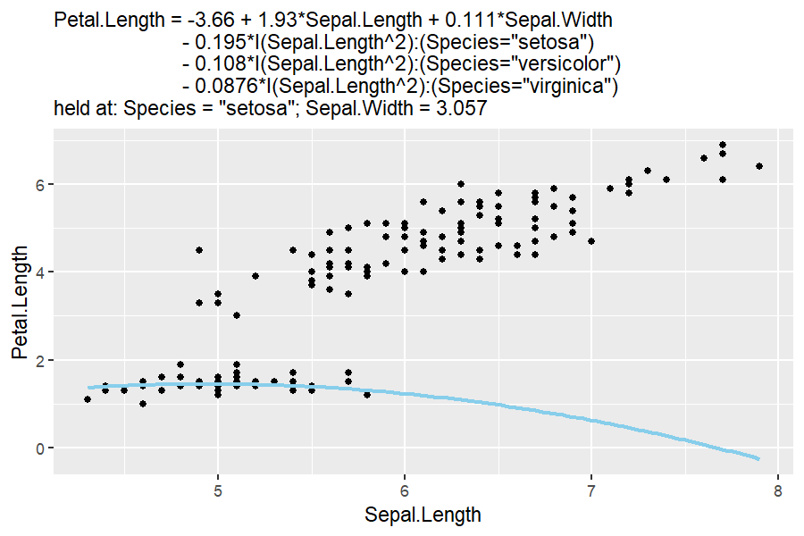

Both take `model = FALSE` (drop the equation line) and
`prepend`/`append` strings. Long equations are wrapped to the plot, and
anything else you pass goes to `lm_equation()` — `style = "brackets"` to
always label factor terms by level alone, for instance. Left alone, the
style is chosen to fit the plot.

## `autoplot()` — a complete plot in one call

`autoplot()` on an `lm` builds the whole plot: the model’s own data as a
scatter with a `geom_slice()` line — and its confidence ribbon — through
it. The model’s first numeric predictor goes on the x-axis (override
with `mapping = aes(x = ...)`), and everything in `...` is passed on to
`geom_slice()`. The result is a regular ggplot, so extend it with `+` as
usual. Pass `interval = "prediction"` for the wider ribbon, or
`interval = "none"` for a bare line.

``` r
library(ggplot2)   # for labs() below; autoplot() itself needs only Applr

autoplot(lm(mpg ~ disp, data = mtcars))
#> 
#> Call:
#> lm(formula = mpg ~ disp, data = mtcars)
#> 
#> Residuals:
#>     Min      1Q  Median      3Q     Max 
#> -4.8922 -2.2022 -0.9631  1.6272  7.2305 
#> 
#> Coefficients:
#>              Estimate Std. Error t value Pr(>|t|)    
#> (Intercept) 29.599855   1.229720  24.070  < 2e-16 ***
#> disp        -0.041215   0.004712  -8.747 9.38e-10 ***
#> ---
#> Signif. codes:  0 '***' 0.001 '**' 0.01 '*' 0.05 '.' 0.1 ' ' 1
#> 
#> Residual standard error: 3.251 on 30 degrees of freedom
#> Multiple R-squared:  0.7183, Adjusted R-squared:  0.709 
#> F-statistic: 76.51 on 1 and 30 DF,  p-value: 9.38e-10

# Pass geom_slice() options through; the result is a normal ggplot
autoplot(lm(mpg ~ disp + hp, data = mtcars),
         predict_vars = list(hp = 110), interval = "prediction") +
  labs(title = "Slice at hp = 110")
#> 
#> Call:
#> lm(formula = mpg ~ disp + hp, data = mtcars)
#> 
#> Residuals:
#>     Min      1Q  Median      3Q     Max 
#> -4.7945 -2.3036 -0.8246  1.8582  6.9363 
#> 
#> Coefficients:
#>              Estimate Std. Error t value Pr(>|t|)    
#> (Intercept) 30.735904   1.331566  23.083  < 2e-16 ***
#> disp        -0.030346   0.007405  -4.098 0.000306 ***
#> hp          -0.024840   0.013385  -1.856 0.073679 .  
#> ---
#> Signif. codes:  0 '***' 0.001 '**' 0.01 '*' 0.05 '.' 0.1 ' ' 1
#> 
#> Residual standard error: 3.127 on 29 degrees of freedom
#> Multiple R-squared:  0.7482, Adjusted R-squared:  0.7309 
#> F-statistic: 43.09 on 2 and 29 DF,  p-value: 2.062e-09
```

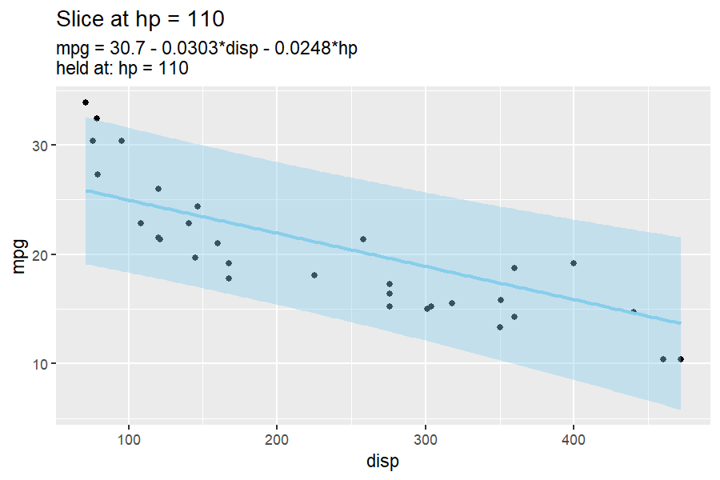

`mapping` goes to `ggplot()` itself: override or add to the automatic
`aes()` (entries named `x` or `y` replace the chosen axes, and
aesthetics such as `color` are inherited by `geom_slice()`, so a model
variable draws one line per group). Choose the x-axis with
`mapping = aes(x = ...)`.

``` r
autoplot(lm(mpg ~ disp + hp + factor(cyl), data = mtcars),
         mapping = aes(x = hp, color = factor(cyl)))
#> 
#> Call:
#> lm(formula = mpg ~ disp + hp + factor(cyl), data = mtcars)
#> 
#> Residuals:
#>    Min     1Q Median     3Q    Max 
#> -4.470 -1.773 -0.413  1.928  5.977 
#> 
#> Coefficients:
#>              Estimate Std. Error t value Pr(>|t|)    
#> (Intercept)  31.14773    1.76712  17.626 2.44e-16 ***
#> disp         -0.02604    0.01042  -2.499   0.0189 *  
#> hp           -0.02114    0.01419  -1.490   0.1479    
#> factor(cyl)6 -4.04719    1.68944  -2.396   0.0238 *  
#> factor(cyl)8 -2.43193    3.23978  -0.751   0.4594    
#> ---
#> Signif. codes:  0 '***' 0.001 '**' 0.01 '*' 0.05 '.' 0.1 ' ' 1
#> 
#> Residual standard error: 2.888 on 27 degrees of freedom
#> Multiple R-squared:  0.8001, Adjusted R-squared:  0.7705 
#> F-statistic: 27.01 on 4 and 27 DF,  p-value: 4.3e-09
```

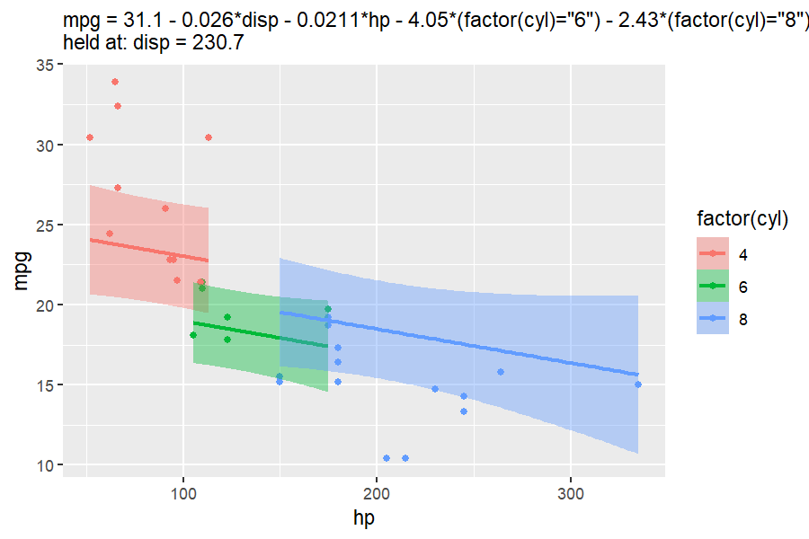

``` r
# Two numeric predictors? Get the interactive 3-D surface instead
autoplot(lm(mpg ~ disp + hp, data = mtcars), type = "3d")
#> 
#> Call:
#> lm(formula = mpg ~ disp + hp, data = mtcars)
#> 
#> Residuals:
#>     Min      1Q  Median      3Q     Max 
#> -4.7945 -2.3036 -0.8246  1.8582  6.9363 
#> 
#> Coefficients:
#>              Estimate Std. Error t value Pr(>|t|)    
#> (Intercept) 30.735904   1.331566  23.083  < 2e-16 ***
#> disp        -0.030346   0.007405  -4.098 0.000306 ***
#> hp          -0.024840   0.013385  -1.856 0.073679 .  
#> ---
#> Signif. codes:  0 '***' 0.001 '**' 0.01 '*' 0.05 '.' 0.1 ' ' 1
#> 
#> Residual standard error: 3.127 on 29 degrees of freedom
#> Multiple R-squared:  0.7482, Adjusted R-squared:  0.7309 
#> F-statistic: 43.09 on 2 and 29 DF,  p-value: 2.062e-09
```

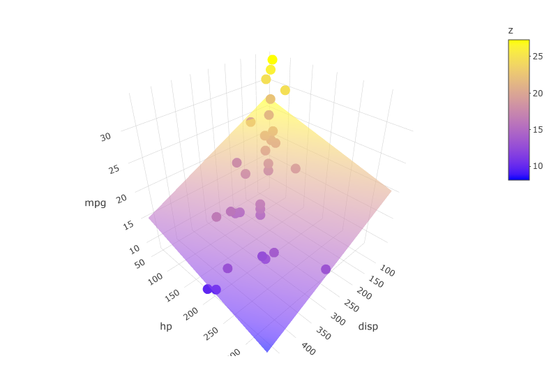

*(static snapshot — the real plot is interactive: drag to rotate, hover
for values)*

Note: the model must be fitted with a `data` argument
(`lm(y ~ x, data = your_data)`) so `autoplot()` can recover the data.

------------------------------------------------------------------------

## Base R plotting

### `slice_2d()`

Create a new base-R plot showing a 2-D slice of a linear model.
Unspecified `x_axis` defaults to the first variable in the model;
unspecified predictor values are held at sensible defaults (numeric →
mean, factor → first level) and reported in the caption.

``` r
model <- lm(mpg ~ disp + hp, data = mtcars)
slice_2d(model)
#--or--
slice_2d(model, x_axis = "hp", disp = 250, n = 150, col = "blue", lwd = 2)
```


### `add_slice_2d()`

Add a 2-D slice line to an *existing* base-R plot. X and Y axis
variables must match the plot it is being added to.

``` r
model <- lm(mpg ~ disp + hp, data = mtcars)
plot(mpg ~ disp, data = mtcars)
add_slice_2d(model)

# Multiple slices on one plot
model <- lm(mpg ~ disp + hp, data = mtcars)
plot(mpg ~ disp, data = mtcars)
add_slice_2d(model, hp = min(mtcars$hp), col = "blue")
add_slice_2d(model, hp = max(mtcars$hp), col = "red", lty = 2)
```

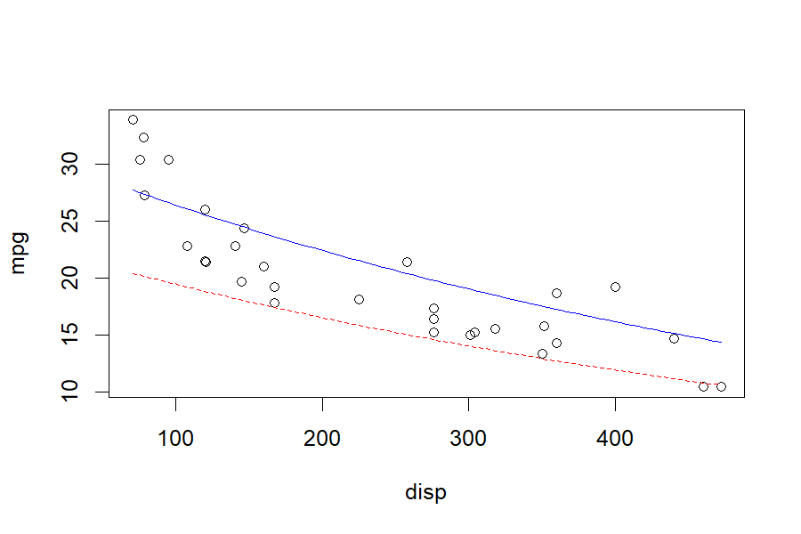

This example does not work because the Y axes do not match (y and 1/y):

``` r
model <- lm(1/mpg ~ disp + hp, data = mtcars)
plot(mpg ~ disp, data = mtcars)
add_slice_2d(model) # will not plot
```

------------------------------------------------------------------------

## More tools

### `scatter_3d()`

Create an interactive 3-D scatter plot with a fitted regression surface
(models must have exactly two numeric predictors). Points are colored by
the response along the `colors` gradient, and transformed terms such as
`I(x^2)` graph over their raw predictors. It is also reachable as
`autoplot(model, type = "3d")`.

``` r
model <- lm(mpg ~ disp + hp, data = mtcars)
scatter_3d(model, colors = c("blue", "yellow"))
```


``` r
# Transformed terms graph over their raw predictors
scatter_3d(lm(mpg ~ wt + I(wt^2) + hp, data = mtcars))
```

*(static snapshot — the real plot is interactive: drag to rotate, hover
for values)*

### `lm_equation()` and `lm_latex()`

Return the fitted model’s equation as plain text, or print it
LaTeX-formatted (ideal for LaTeX or R Markdown documents). Factor terms
are spelled out readably by default (`style = "prettier"`, e.g.
`(Species="setosa")`); `style = "brackets"` shortens these to the level
alone (`[setosa]`), and `style = "raw"` keeps the design-matrix names
(`Speciessetosa`).

``` r
model <- lm(mpg ~ disp + hp, data = mtcars)
lm_equation(model)
#> [1] "mpg = 30.7 - 0.0303*disp - 0.0248*hp"
lm_latex(model)
#> $$\underbrace{\hat{Y_i}}_{\text{Pred. mpg}} = 30.7 - 0.0303\underbrace{X_{1i}}_{\text{disp}} - 0.0248\underbrace{X_{2i}}_{\text{hp}}$$
```

### `diagnose()`

Draw three base-R diagnostic plots for a model in one call: Residuals vs
Fitted, Normal Q-Q, and the residuals in order.

``` r
model <- lm(mpg ~ wt, data = mtcars)
diagnose(model)
```

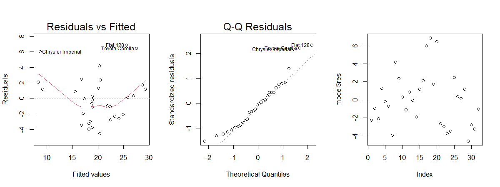

### `theme_lc()`

A custom **ggplot2** theme plus default aesthetic tweaks.

``` r
library(ggplot2)
ggplot(mtcars, aes(wt, mpg)) +
  geom_point() +
  theme_lc()
```

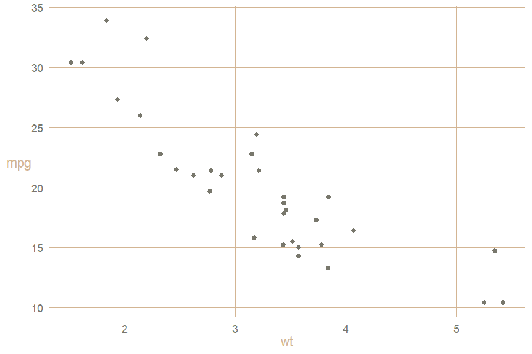

### Advanced: `StatSlice` and `GeomSlice`

Low-level **ggproto** objects that power `geom_slice()`. Most users
never need to call these directly, but you can for custom layers. Note
that `StatSlice` reads the aesthetic mapping from its params —
`geom_slice()` supplies it automatically, but a raw `layer()` call must
pass it explicitly:

``` r
library(ggplot2)
model <- lm(mpg ~ disp + hp + cyl, data = mtcars)

ggplot(mtcars, aes(disp, mpg)) +
  geom_point() +
  layer(stat = StatSlice,
        geom = GeomSlice,
        position = "identity",
        inherit.aes = TRUE,
        params = list(model = model, predict_vars = list(hp = 110),
                      mapping = aes(disp, mpg)))
```

------------------------------------------------------------------------

## Tips

• For multi-variable models, use `predict_vars` (e.g. `list(hp = 110)`)
to choose the slice you want.\
• Factors included in `facet_wrap()` or `facet_grid()` should also
appear in the model you pass to `geom_slice()`.\
• New to R modeling? `lm(y ~ x1 + x2, data = df)` fits a linear model of
`y` on `x1` and `x2`.

## Getting help

• Use R’s built-in help: `?geom_slice`, `?autoplot.lm`, `?slice_2d`,
`?scatter_3d`, etc.\
• Found a bug or have a suggestion? Open an issue at
<https://github.com/saundersg/Applr/issues>.

Enjoy clearer model visualizations with **Applr**!

## Attributions

We thank Cameron McClellan and James Beeson for their work on the
package, and of course Garrett Saunders for being a remarkable teacher
and inspiration to do great things with statistics!
